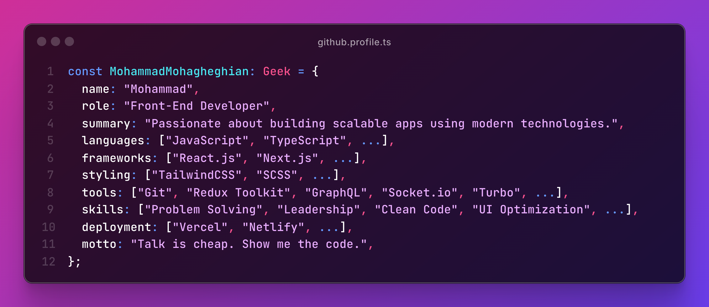

<h1> Hey! Nice to see you.</h1>

    
   

<h2>About Me 📖</h2>

<b>
 

I’m a passionate Front-end Developer turning ideas into seamless, impactful digital experiences! 🎨🚀 Specializing in JavaScript, React, and modern tools, I create responsive, user-friendly interfaces that engage and solve real-world challenges. 🖥️😊
Self-taught since my teens, I love mastering cutting-edge tech and teaming up with innovators to deliver game-changing solutions! 🌟🤝 From optimizing performance to boosting UX, I’m all about creating value through code! 💪🔥 <a href="mailto:vito.mohagheghian@gmail.com">Let’s collaborate! 📩🎉</a> 
 

</b>

<h3><a href="https://mghn.info">More on My Portfolio</a></h3>

<h2>My Current Tech Stack 🚀</h2>

<h3>Skills & Tools</h3>

     
                                                                                 

<h3>Currently Advancing My Skills In</h3>

            

<h3>Planning to Learn</h3>

                  

<h2>Latest Blog Posts 💬</h2>

<!-- BLOG-POST-LIST:START -->
- [TailwindCSS's Class Order Pattern: Best Practices 🍃](https://dev.to/vitomohagheghian/tailwindcsss-classes-order-pattern-best-practice-1g1)
- [Auto Dev.to Posts Updater on GitHub README](https://dev.to/vitomohagheghian/auto-blogs-posts-updater-on-github-readme-3d0h)
- [The Best Way to Import Images in React.js and Next.js 🚀](https://dev.to/vitomohagheghian/the-best-way-to-import-images-in-reactjs-and-nextjs-eop)
- [The Easiest Way to Create React NPM Packages](https://dev.to/vitomohagheghian/the-easiest-way-to-create-react-npm-packages-2d9l)
<!-- BLOG-POST-LIST:END -->

<h2>Open Source Projects I Own 🐙</h2>

 

<h2>Open Source Projects I've Contributed To 🐙</h2>

<h2>Support Me 🫠</h2>
 

  

